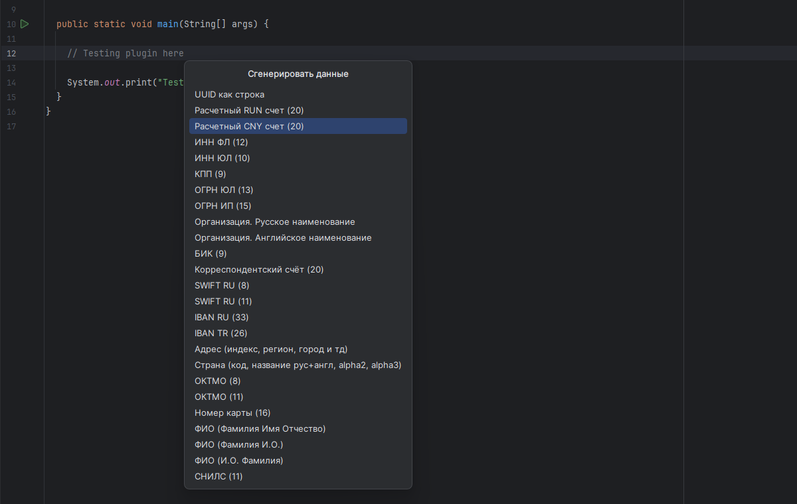
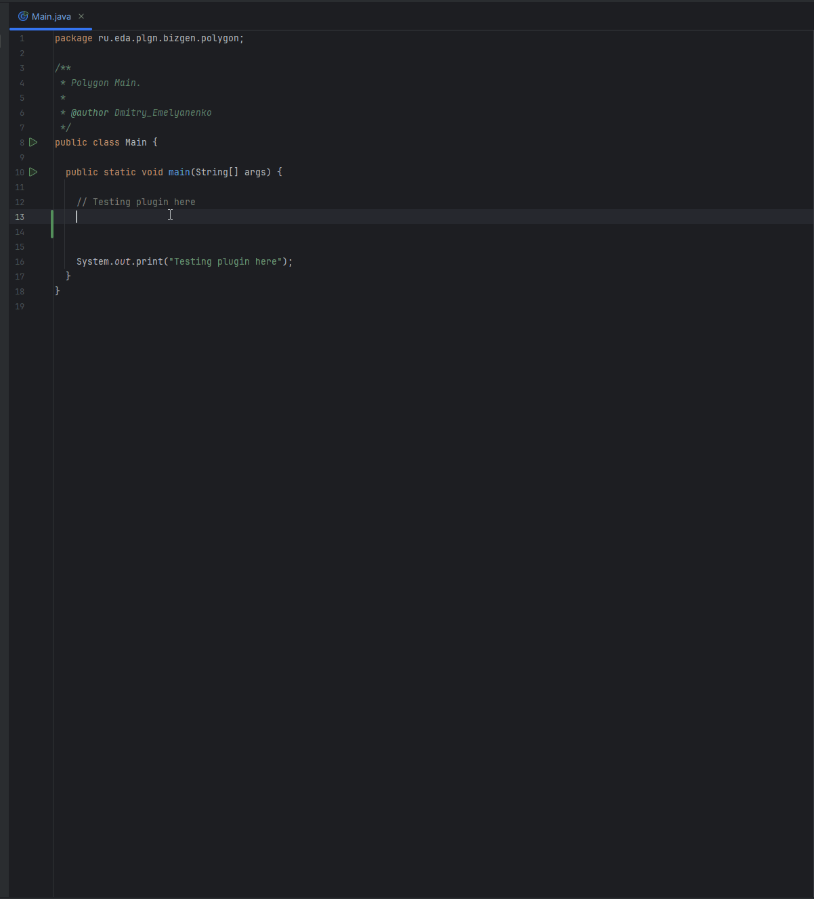
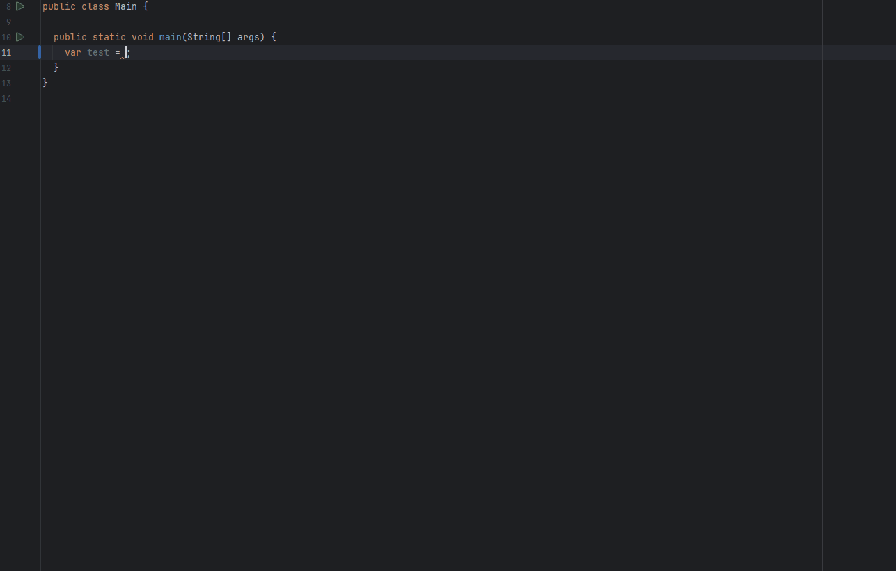

<h1 align="center">
  
     
    Ru BizGen
</h1>

    
    
    
     
    
    
    
    
    

# Генератор российских (по большей части) тестовых данных

Ускоряйте разработку с мгновенной генерацией приближенных к реалистичным тестовых данных прямо в редакторе кода!

## ⚠️ Важно:

Любые совпадения сгенерированных ИНН, номеров счетов, названий организаций, ОГРН, ОКТМО и других данных являются случайными. Плагин не
использует реальные данные для генерации — все значения создаются алгоритмически.

## Основные возможности:

- 🚀 **Быстрая генерация** данных
- ⌨️ **Горячие клавиши** (по умолчанию Ctrl+Alt+E, настраивается)
- 🎛️ **Гибкие настройки** для полного контроля
- 🔔 **Настраиваемые уведомления** о срабатывании генераторов
- 👀 **Предпросмотр данных** перед вставкой
- 📋 **Интеграция с Alt+Ins** — вызывается в стандартном диалоге генерации кода IDEA

## Доступные генераторы:

- 💰 **Банковские реквизиты:** расчетный счет (RUB, CNY), корреспонденский счет, БИК, SWIFT (российских банков), IBAN (РФ и Турция)
- 👤 **ФИО:** полное, сокращённое, инициалы
- 🏢 **Юр. данные:** ИНН (ФЛ и ЮР), ОГРН (ИП и ЮЛ), ОКТМО, КПП
- 🏛️ **Название организации:** на русском и английском
- 📍 **Страна и Адрес:** реалистичные форматы
- 🔢 **Прочее:** UUID

## Как использовать:

Просто вызовите окно генератора с помощью горячей клавиши для доступа к различным типам тестовых данных. Интуитивный интерфейс позволяет
быстро вставлять реалистичные данные именно туда, где они нужны.

### Способы вызова:

- `Ctrl+Alt+E` (Windows/Linux) или `⌘⌥E` (Mac) — прямое открытие плагина
- `Alt+Ins` → **Ru BizGen** — через стандартное меню генерации кода IDEA

Горячие клавиши можно изменить в настройках IDE.

## Расширенные настройки:

Доступны по пути: **Настройки → Tools → Ru BizGen**

### Управление генераторами

- ✔️ Включение/отключение конкретных генераторов
- ⬆️⬇️ Изменение порядка генераторов
- 🔄 Сброс к настройкам по умолчанию

### Уведомления и предпросмотр

- 🔔 Настройка оповещений о генерации
- 👀 Просмотр примеров данных
- 📋 Тестирование генераторов перед использованием

## Преимущества плагина:

- ⏱️ **Экономия времени** - генерация данных за секунды
- 🧩 **Гибкость** - полная адаптация под ваши нужды
- 💻 **Удобство** - работа прямо в редакторе
- 🛠️ **Для разработчиков** - создано разработчиком для разработчиков