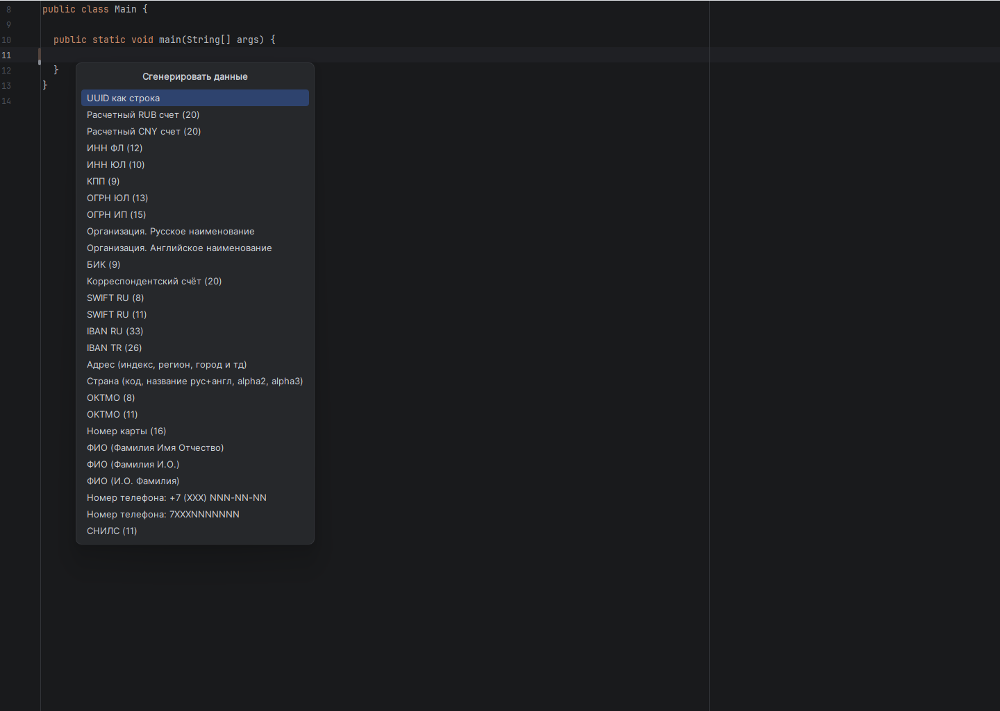
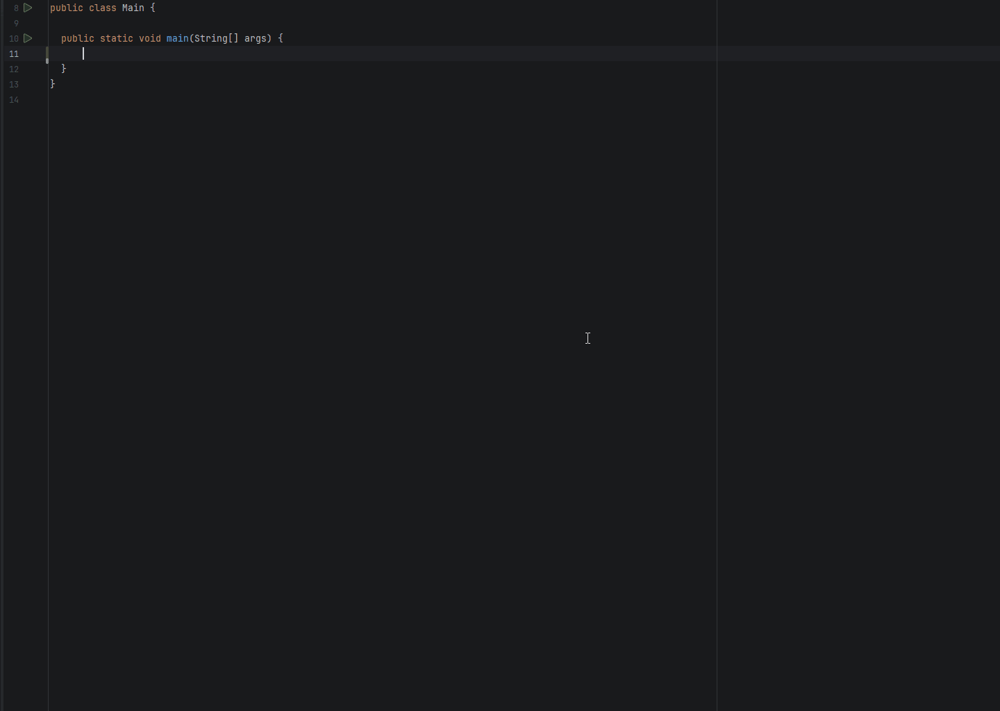
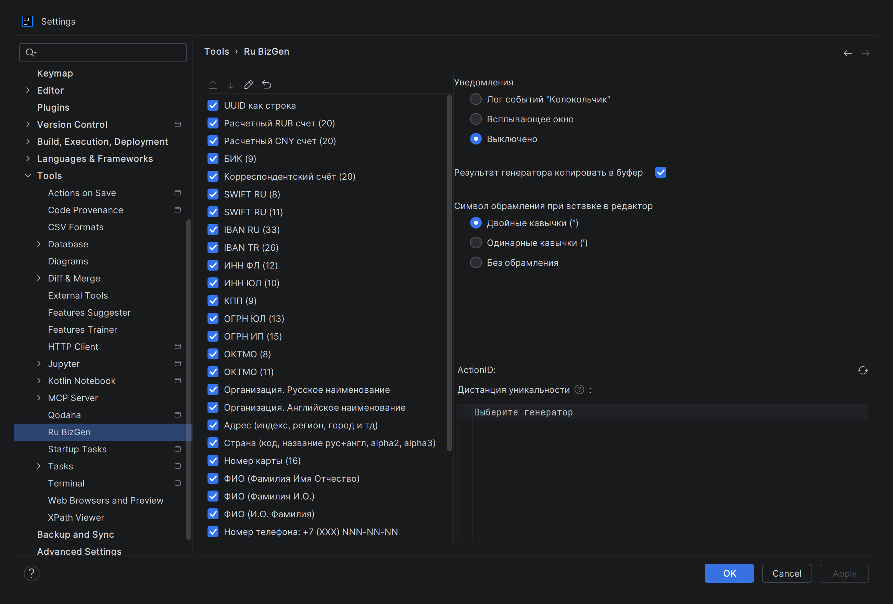
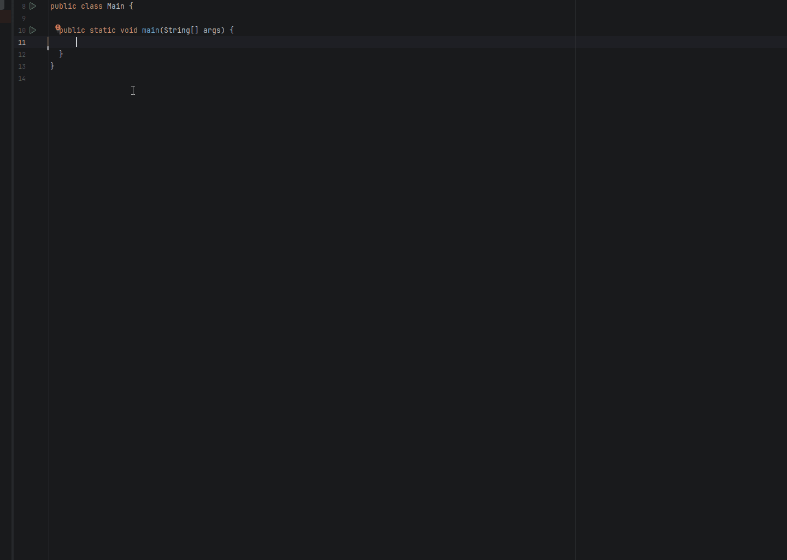

<h1 align="center">
  
    <br />
    Ru BizGen
</h1>

<p align="center">
    <a href="https://plugins.jetbrains.com/plugin/29294-ru-bizgen"></a>
    <a href="https://plugins.jetbrains.com/plugin/29294-ru-bizgen/reviews"></a>
    <a href="https://plugins.jetbrains.com/plugin/29294-ru-bizgen"></a>
    <br />
    <a href="https://github.com/DmitryEm506/Ru-BizGen/actions"></a>
    <a href="https://dmitryem506.github.io/Ru-BizGen/"></a>
    <a href="https://dmitryem506.github.io/Ru-BizGen/images/kover/index.html"></a>
    <a></a>
    <a></a>
</p>

# Генератор российских (и не только) тестовых данных

Ускоряйте разработку с мгновенной генерацией приближённых к реалистичным тестовых данных прямо в редакторе кода.

## ⚠️ Важно

Любые совпадения с реальными конфиденциальными данными (ИНН, номера счетов, номера карт, СНИЛС, номера телефонов, наименования организаций,
ОГРН, ОКТМО и другие) являются случайными и не предназначены для использования в реальных системах.

Все данные генерируются **локально внутри плагина**, без обращений к внешним сервисам.

## ✨ Основные возможности

- 🚀 **Быстрая генерация** данных прямо в редакторе
- ⌨️ **Горячие клавиши** (по умолчанию Ctrl+Alt+E, можно переназначить)
- 🎛️ **Гибкие настройки генераторов** (порядок, включение/отключение, переименование)
- 💬 **Символ обрамления** при вставке в редактор (двойные кавычки, одинарные, без обрамления)
- 🔔 **Настраиваемые уведомления** о срабатывании генераторов
- 👀 **Предпросмотр результата** перед вставкой
- 📋 **Интеграция с Alt+Ins** — доступен в стандартном диалоге генерации кода IntelliJ
- 🔄 **Обновления без сброса настроек** — порядок, активность и пользовательские имена генераторов сохраняются автоматически

## 🧩 Доступные генераторы

<p align="center">
  
</p>

- 💰 **Банковские реквизиты:** расчётный счёт (RUB, CNY), корреспондентский счёт, БИК, SWIFT (российских банков), IBAN (РФ и Турция)
- 👤 **Физическое лицо:** ФИО (полное, сокращённое, инициалы), ИНН, номер банковской карты, номер телефона, СНИЛС, паспорт РФ (с пробелом и без), загранпаспорт РФ (номер и MRZ)
- 🏢 **Юридические данные:** ИНН (ФЛ и ЮЛ), ОГРН (ИП и ЮЛ), ОКТМО (8 и 11 цифр), КПП
- 🏛️ **Название организации:** на русском и английском языках
- 📍 **Геоданные:** страна и адрес в реалистичных форматах
- 🔢 **Прочее:** UUID

## ▶️ Как использовать

<p align="center">
  
</p>

Вызовите окно генератора и вставляйте тестовые данные прямо в код — без копирования из сторонних сервисов.

### Способы вызова

- `Ctrl+Alt+E` (Windows/Linux) или `⌘⌥E` (Mac)
- `Alt+Ins` → **Ru BizGen**
- `Shift+Shift` → **Ru BizGen**

## ⚙️ Расширенные настройки

Доступны по пути: **Settings → Tools → Ru BizGen**

<p align="center">
  
</p>

Настройки позволяют управлять поведением генераторов и настраивать их под ваши потребности.

<p align="center">
  
</p>

### Управление генераторами

- ✔️ Включение/отключение генераторов
- ⬆️⬇️ Изменение порядка
- ✏️ Переименование генераторов
- 🔄 Сброс к настройкам по умолчанию

### Уведомления и предпросмотр

- 🔔 Выбор способа уведомлений
- 👀 Предпросмотр результата генерации
- 💬 Символ обрамления при вставке (`"`, `'`, без обрамления)
- 📋 Быстрое тестирование генераторов

## 💎 Преимущества

- ⏱️ **Экономия времени** — генерация за микросекунды
- 🧩 **Гибкость** — легко адаптируется под задачи проекта
- 💻 **Удобство** — работа прямо в IDE
- 🛠️ **Для разработчиков** — создан разработчиком для разработчиков

---

# 🤖 MCP-сервер

Помимо плагина для IntelliJ IDEA, Ru BizGen доступен как **MCP-сервер** (Model Context Protocol).
Это позволяет подключать генерацию тестовых данных к любым MCP-совместимым AI-клиентам
(Claude Desktop, Cursor, Cline, Windsurf и др.) и генерировать данные прямо в чате или через AI-агента.

Все данные генерируются **локально**, без обращений к внешним сервисам — так же, как в плагине.

## ✨ Возможности

- 🧩 **5 категорийных MCP-инструментов** — `ru-bizgen_generator_<category>` с параметром `type` (enum) для выбора генератора и опциональным `count`
  для пакетной генерации (до 1000 значений за вызов)
- 🔒 **Полностью локальная генерация** — нет сетевых вызовов, данные не покидают ваш компьютер
- ⚡ **Микросекундная производительность** — те же алгоритмы, что и в плагине
- 🌐 **Streamable HTTP транспорт** — современный MCP-протокол поверх HTTP
- 🐳 **Docker-ready** — готовый `Dockerfile` и `docker-compose.yml`
- 📋 **Стабильные `type`-ключи** — значения enum вычисляются из UUID-идентификаторов генераторов, а не из имён классов, и не меняются при
  рефакторинге

## 🛠 Технологический стек

| Компонент      | Версия          |
|:---------------|:----------------|
| MCP Kotlin SDK | 0.15.0          |
| Ktor / Netty   | 3.5.1           |
| JDK            | 21              |
| Транспорт      | Streamable HTTP |

## ▶️ Быстрый старт

MCP-сервер можно запустить тремя способами.

### Способ 1. Gradle (из исходников)

```bash
# Сборка дистрибутива
./gradlew :ru-bizgen-mcp:installDist

# Запуск (по умолчанию 127.0.0.1:8081)
./ru-bizgen-mcp/build/install/ru-bizgen-mcp/bin/ru-bizgen-mcp

# С явным указанием host/port
./ru-bizgen-mcp/build/install/ru-bizgen-mcp/bin/ru-bizgen-mcp --host=0.0.0.0 --port=9090
```

### Способ 2. Docker

```bash
docker build -f ru-bizgen-mcp/Dockerfile -t ru-bizgen-mcp .
docker run -p 8081:8081 ru-bizgen-mcp
```

### Способ 3. Docker Compose

```bash
docker compose -f ru-bizgen-mcp/docker-compose.yml up -d
```

После запуска сервер доступен по адресу `http://127.0.0.1:8081`.

## ⚙️ Конфигурация

Параметры передаются как аргументы командной строки:

| Параметр  | По умолчанию | Описание                                        |
|:----------|:-------------|:------------------------------------------------|
| `--host=` | `127.0.0.1`  | Адрес для привязки (`0.0.0.0` — все интерфейсы) |
| `--port=` | `8081`       | Порт MCP-сервера                                |

### Healthcheck

Эндпоинт `GET /health` возвращает `{"status":"UP"}` — удобно для Docker healthcheck и мониторинга:

```bash
curl http://127.0.0.1:8081/health
```

## 🔌 Подключение MCP-клиента

MCP-сервер использует **Streamable HTTP** транспорт. Эндпоинт MCP — `http://127.0.0.1:8081/mcp`.

### Cursor

`Settings → Cursor Settings → MCP → Add MCP Server`:

```json
{
  "mcpServers": {
    "ru-bizgen": {
      "url": "http://127.0.0.1:8081/mcp"
    }
  }
}
```

### Claude Desktop

Добавьте в `claude_desktop_config.json` (поддержка Streamable HTTP в актуальных версиях):

```json
{
  "mcpServers": {
    "ru-bizgen": {
      "type": "streamableHttp",
      "url": "http://127.0.0.1:8081/mcp"
    }
  }
}
```

> **💡 Универсально:** любой MCP-клиент с поддержкой Streamable HTTP подключается по URL `http://<host>:<port>/mcp`.

## 🧩 Доступные инструменты (5 категорийных)

Имя каждого инструмента имеет формат `ru-bizgen_generator_<category>`. Каждый инструмент принимает:
- **`type`** (обязательный, enum) — выбор генератора внутри категории
- **`count`** (опциональный, int, 1..1000, по умолчанию 1) — количество значений для пакетной генерации

### `ru-bizgen_generator_technical` — Технические

| `type` | Описание        |
|:-------|:----------------|
| `uuid` | UUID как строка |

### `ru-bizgen_generator_banking` — Банковские реквизиты

| `type`           | Описание                              |
|:-----------------|:--------------------------------------|
| `account_rub`    | Расчетный RUB счёт (20 цифр)          |
| `account_cny`    | Расчетный CNY счёт (20 цифр)          |
| `bank_account`   | Корреспондентский счёт (20 цифр)      |
| `bik`            | БИК (9 цифр)                          |
| `swift_ru8`      | SWIFT российских банков (8 символов)  |
| `swift_ru11`     | SWIFT российских банков (11 символов) |
| `iban_ru`        | IBAN РФ (33 символа)                  |
| `iban_turkish`   | IBAN Турция (26 символов)             |

### `ru-bizgen_generator_legal` — Юридические данные

| `type`           | Описание                         |
|:-----------------|:---------------------------------|
| `inn_individual` | ИНН физического лица (12 цифр)   |
| `inn_legal`      | ИНН юридического лица (10 цифр)  |
| `ogrn_legal`     | ОГРН юридического лица (13 цифр) |
| `ogrn_ip`        | ОГРН ИП (15 цифр)                |
| `kpp`            | КПП (9 цифр)                     |
| `oktmo8`         | ОКТМО (8 цифр)                   |
| `oktmo11`        | ОКТМО (11 цифр)                  |
| `org_ru_name`    | Название организации (рус.)      |
| `org_eng_name`   | Название организации (англ.)     |

### `ru-bizgen_generator_geo` — Геоданные

| `type`     | Описание                                        |
|:-----------|:------------------------------------------------|
| `address`  | Адрес (индекс, регион, город и т.д.)            |
| `country`  | Страна (код, название рус+англ, alpha2, alpha3) |

### `ru-bizgen_generator_personal` — Персональные данные

| `type`                       | Описание                         |
|:-----------------------------|:---------------------------------|
| `card_number`                | Номер банковской карты (16 цифр) |
| `fio_full`                   | ФИО (Фамилия Имя Отчество)       |
| `fio_short`                  | ФИО (Фамилия И.О.)               |
| `fio_initials`               | ФИО (И.О. Фамилия)               |
| `phone_number_ru_format`     | Телефон: +7 (XXX) NNN-NN-NN      |
| `phone_number_ru_digit`      | Телефон: 7XXXNNNNNNN             |
| `snils`                      | СНИЛС (11 цифр)                  |
| `passport_ru_spaced`         | Паспорт РФ (с пробелом)          |
| `passport_ru_compact`        | Паспорт РФ (без пробела)         |
| `foreign_passport_ru_number` | Загранпаспорт РФ (номер)         |
| `foreign_passport_ru_mrz`    | Загранпаспорт РФ (MRZ)           |

> **⚠️ Важно:** Все генерируемые значения являются случайными и не относятся к реальным субъектам. Совпадения с реальными данными случайны.

---

# ⚡ Отчет производительности

В этом разделе представлены результаты тестирования скорости работы генераторов, выполненные с
использованием [JMH](https://github.com/openjdk/jmh)
(Java Microbenchmark Harness).

Все измерения проводятся в изолированных условиях для обеспечения точности и воспроизводимости результатов.

## 🛠 Тестовое окружение

| Компонент                  | Спецификация                                                   |
|:---------------------------|:---------------------------------------------------------------|
| **Виртуальная машина**     | OpenJDK 64-Bit Server VM (21.0.11+10-LTS)                      |
| **Версия JDK**             | 21.0.11                                                        |
| **Фреймворк бенчмаркинга** | JMH 1.36                                                       |
| **Цель тестирования**      | Измерение среднего времени выполнения одного вызова генератора |

## ⚙️ Конфигурация JMH

Значения ниже соответствуют аннотациям `BaseGeneratorBenchmark`
(`ru-bizgen-perf/src/jmh/kotlin/.../bench/BaseGeneratorBenchmark.kt`).

### 📈 Режим измерений

* **Основной режим:** `AverageTime` (среднее время на операцию)
* **Единица измерения:** микросекунды (µs) на операцию

### 🔥 Фаза разогрева (Warmup)

Позволяет JVM выполнить оптимизацию кода и стабилизировать производительность.

* **Количество итераций:** 3
* **Длительность итерации:** 1 s

### ⏱️ Фаза измерения (Measurement)

Непосредственный замер производительности.

* **Количество итераций:** 10
* **Длительность итерации:** 2 s

### 🖥 Конфигурация JVM

Каждый тест запускается в отдельном процессе для чистоты эксперимента.

* **Количество процессов (Fork):** 2
* **Параметры JVM:** `-Xms1g -Xmx1g -XX:+UseG1GC -XX:+AlwaysPreTouch`

## 📊 Результаты тестирования

| Генератор                                                            | Среднее время µs/оп | Выделяемый объем данных в KB |
|----------------------------------------------------------------------|---------------------|------------------------------|
| UuidAsStrGenerator - _UUID как строка_                               | 0.455611            | 0.391                        |
| AccountRubGenerator - _Расчетный RUB счет (20)_                      | 0.530002            | 1.077                        |
| AccountCnyGenerator - _Расчетный CNY счет (20)_                      | 0.526572            | 1.082                        |
| InnIndividualGenerator - _ИНН ФЛ (12)_                               | 0.109294            | 0.345                        |
| InnLegalGenerator - _ИНН ЮЛ (10)_                                    | 0.078663            | 0.266                        |
| KppGenerator - _КПП (9)_                                             | 1.367849            | 2.458                        |
| OgrnLegalGenerator - _ОГРН ЮЛ (13)_                                  | 1.781428            | 3.101                        |
| OgrnIpGenerator - _ОГРН ИП (15)_                                     | 1.428348            | 2.472                        |
| OrgRuNameGenerator - _Организация. Русское наименование_             | 0.177739            | 0.478                        |
| OrgEngNameGenerator - _Организация. Английское наименование_         | 0.159804            | 0.311                        |
| BikGenerator - _БИК (9)_                                             | 0.064798            | 0.244                        |
| BankAccountGenerator - _Корреспондентский счёт (20)_                 | 0.727044            | 1.202                        |
| Swift8RuGenerator - _SWIFT RU (8)_                                   | 0.068766            | 0.055                        |
| Swift11RuGenerator - _SWIFT RU (11)_                                 | 0.477214            | 0.730                        |
| IbanRuGenerator - _IBAN RU (33)_                                     | 2.281479            | 4.696                        |
| IbanTurkishGenerator - _IBAN TR (26)_                                | 1.626916            | 3.277                        |
| AddressGenerator - _Адрес (индекс, регион, город и тд)_              | 3.975766            | 5.888                        |
| CountryGenerator - _Страна (код, название рус+англ, alpha2, alpha3)_ | 1.060561            | 2.531                        |
| Oktmo8Generator - _ОКТМО (8)_                                        | 0.085847            | 0.055                        |
| Oktmo11Generator - _ОКТМО (11)_                                      | 0.239180            | 0.055                        |
| CardNumberGenerator - _Номер карты (16)_                             | 0.329218            | 0.505                        |
| FIOFullGenerator - _ФИО (Фамилия Имя Отчество)_                      | 0.524937            | 0.617                        |
| FIOShortGenerator - _ФИО (Фамилия И.О.)_                             | 0.497833            | 0.566                        |
| FIOInitialsGenerator - _ФИО (И.О. Фамилия)_                          | 0.500494            | 0.566                        |
| PhoneNumberRuFormatGenerator - _Номер телефона: +7 (XXX) NNN-NN-NN_  | 0.283754            | 0.658                        |
| PhoneNumberRuDigitGenerator - _Номер телефона: 7XXXNNNNNNN_          | 0.251596            | 0.535                        |
| SnilsGenerator - _СНИЛС (11)_                                        | 0.626880            | 1.029                        |
| PassportRuSpacedGenerator - _Паспорт РФ (с пробелом)_                | 0.744428            | 1.208                        |
| PassportRuCompactGenerator - _Паспорт РФ (без пробела)_              | 0.709420            | 1.208                        |
| ForeignPassportRuNumberGenerator - _Загранпаспорт РФ (номер)_        | 0.391653            | 0.704                        |
| ForeignPassportRuMrzGenerator - _Загранпаспорт РФ (MRZ)_             | 2.902907            | 3.551                        |

> **💡 Вывод:** Все генераторы работают в **микросекундном диапазоне**,
> обеспечивая мгновенный отклик в интерфейсе IDE без заметных задержек для пользователя.

> **📌 Примечание:** Запуск бенчмарков и создание отчёта происходит в модуле `ru-bizgen-perf/`